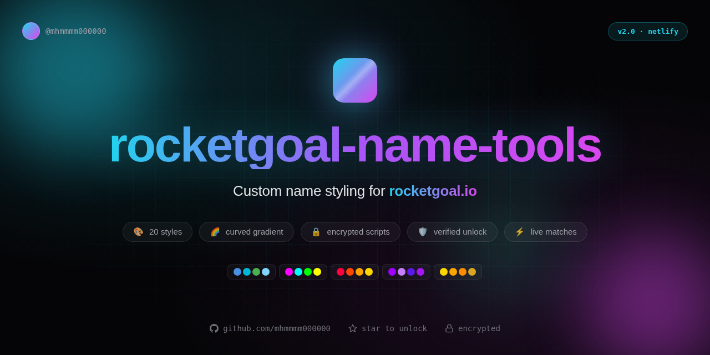

<div align="center">



# rocketgoal-name-tools

Custom name styling tools for [rocketgoal.io](https://rocketgoal.io).

Style your in-game name with curves, gradients, and promo text — works in live matches, everyone sees it.

[](https://rocketgoal-name-tools.netlify.app/)
[](https://github.com/mhmmmm000000/rocketgoal-name-tools/stargazers)
[](LICENSE)
[](https://github.com/mhmmmm000000)
[](https://www.netlify.com/)

</div>

---

## What this is

A Next.js web app that generates an encrypted browser-console script for setting your rocketgoal.io nickname with rich-text styling — curved rainbow letters, neon colors, optional `SUB TO` + YouTube URL promo.

**Live tool:** **https://rocketgoal-name-tools.netlify.app/** (replace with your URL after deploy)

To use the generator, you must:
1. ⭐ Star this repo
2. 👤 Follow [@mhmmmm000000](https://github.com/mhmmmm000000)
3. 🔑 Verify with GitHub OAuth (1 click, no PAT needed)

The app re-verifies on every script generation. If you un-follow or un-star after unlocking, the script will set your in-game name to `IM A LOSER UNFOLLOWED`. Don't game the system.

## Features

- 🎨 **20 style presets** — Ocean, Sunset, Cyber, Inferno, Matrix, Gold, Plasma, Toxic, Acid, and 11 more
- 🌈 **Curved rainbow names** — each letter rotated + offset for a smile arc
- 🔒 **Encrypted scripts** — XOR + base64 obfuscated, can't be casually copied from someone else's console
- 🛡️ **Server-verified unlock** — re-checks follow/star on every generation via GitHub API
- 🔐 **OAuth 1-click unlock** — no PAT friction, just click "Verify with GitHub"
- 📱 **Fully responsive** — works on mobile, tablet, desktop
- 🌙 **Dark mode** — sleek, glass-morphism UI

## How it works

The rocketgoal.io nickname field accepts Unity TextMeshPro rich-text tags. The Firebase Cloud Function stores the nickname as a plain string without sanitizing these tags. When the name renders in the goal celebration banner, TextMeshPro parses the tags and renders styled text.

| Tag | Effect |
|-----|--------|
| `<color=#hex>` | Per-letter color |
| `<size=N>` | Text size |
| `<rotate=N>` | Per-letter rotation |
| `<voffset=N>` | Vertical offset |
| `<b>` | Bold |

**Technique:**
1. Hook `window.fetch` in the browser console
2. Intercept the nickname update request
3. Replace the body with a rich-text-styled nickname
4. The modified nickname gets stored on Firebase
5. Other clients receive it and render with TextMeshPro parsing

## Quick start (for users)

1. Go to the [live tool](https://rocketgoal-name-tools.netlify.app/)
2. Click **Unlock generator**
3. Follow the on-screen steps (follow + star + verify with GitHub)
4. Customize your name (style, curve, promo text)
5. Click **Generate Script** and copy
6. Open [rocketgoal.io](https://rocketgoal.io), press `F12`, paste into Console, press Enter
7. Change your name in the game UI to trigger the hook
8. Refresh the page — your new name is live
9. Score a goal to see the curved gradient banner

## Style presets (20 total)

| Style | Colors | Style | Colors |
|-------|--------|-------|--------|
| Ocean | Blue → Teal → Green → Light Blue | Mint | Cool mint greens |
| Sunset | Coral → Orange → Yellow → Pink | Rose | Hot pinks |
| Cyber | Cyan → Magenta → Green → Yellow | Electric | Blue → Cyan → Green → Yellow |
| Ice | Light blue pastels | Plasma | Magenta → Violet → Pink → Orange |
| Royal | Deep purple gradient | Toxic | Acid greens |
| Inferno | Red → Orange → Yellow → Gold | Blood | Deep reds |
| Matrix | Green code rain | Sky | Sky blues |
| Candy | Soft pastels | Bronze | Bronze tones |
| Void | Dark purples | Arctic | Arctic ice blues |
| Gold | Premium gold tones | Acid | Acid yellow-greens |

## Self-host

See [DEPLOYMENT.md](DEPLOYMENT.md) for full instructions on deploying to Netlify (recommended), Vercel, or your own server.

## Repo structure

```
.
├── README.md                      ← this file
├── DEPLOYMENT.md                  ← deployment guide
├── LICENSE                        ← MIT
├── netlify.toml                   ← Netlify config
├── package.json                   ← Next.js dependencies
├── next.config.ts
├── tsconfig.json
├── tailwind.config.ts
├── postcss.config.mjs
├── eslint.config.mjs
├── components.json                ← shadcn/ui config
├── .env.example                   ← env var template
├── .gitignore
└── src/
    ├── app/
    │   ├── layout.tsx             ← root layout
    │   ├── page.tsx               ← main UI (landing + generator)
    │   ├── globals.css            ← dark theme styles
    │   └── api/
    │       ├── auth/github/route.ts       ← OAuth start
    │       ├── auth/callback/route.ts     ← OAuth callback + verification
    │       └── generate/route.ts          ← script generator + shame system
    ├── components/ui/             ← shadcn/ui components
    ├── hooks/
    │   └── use-toast.ts
    └── lib/
        └── utils.ts
```

## Issues

If the tool stops working, it's likely because:
1. rocketgoal.io patched the rich-text injection (most likely)
2. The Firebase endpoint changed
3. GitHub OAuth app misconfigured

Open an issue and describe what happened. Don't open issues asking for cheats — this repo only covers the name tool.

## Disclaimer

- Not affiliated with rocketgoal.io or PocketHaven
- Use at your own risk — the devs could patch this any day
- Don't use offensive names
- Don't abuse the system (un-starring after unlocking = shame name)

## License

MIT — see [LICENSE](LICENSE). If you fork, keep the @mhmmmm000000 credit.

---

<div align="center">

Made by [@mhmmmm000000](https://github.com/mhmmmm000000) · ⭐ Star this repo to support

</div>
